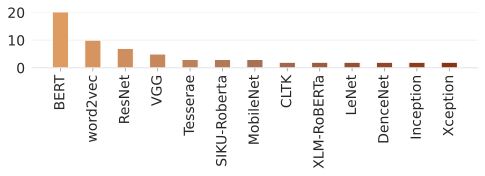

# Machine Learning for Ancient Languages: A Survey
**Thea Sommerschield\*, Yannis Assael\*, John Pavlopoulos\*, Vanessa Stefanak, Andrew Senior, Chris Dyer, John Bodel, Jonathan Prag, Ion Androutsopoulos, Nando de Freitas**

## This repository

This repository serves as a platform to host the taxonomy of the research works we have reviewed, as well as to maintain an up-to-date catalogue of active interdisciplinary Machine Learning projects focused on ancient languages.(\*)

Pull requests are highly encouraged. If you are working on or come across new publications in the field, please feel free to submit a pull request to update the repository, and help us maintain a dynamic and useful catalogue for the community!

(\*) <i> We consider all languages in use across the world, written on any medium and in any script, between the birth of writing systems in ancient Mesopotamia (3400 BCE) up until the conventional end of 'ancient history' in the late first millennium CE. This remit excludes therefore e.g. modern printed texts in ancient languages, Medieval scribal cultures etc. </i>


## Navigation
- [Taxonomy](https://github.com/ancientml/ml-for-ancient-languages/tree/main/taxonomy/README.md)
- [Full article @ Computational Linguistics](https://direct.mit.edu/coli/article/doi/10.1162/coli_a_00481/116160/Machine-Learning-for-Ancient-Languages-A-Survey)


## Citation

```
@article{sommerschield2023machine,
  author = {Sommerschield*, Thea and Assael*, Yannis and Pavlopoulos*, John and Stefanak, Vanessa and Senior, Andrew and Dyer, Chris and Bodel, John and Prag, Jonathan and Androutsopoulos, Ion and de Freitas, Nando},
  title = {Machine Learning for Ancient Languages: A Survey},
  journal = {Computational Linguistics},
  pages = {1-44},
  year = {2023},
  month = {05},
  issn = {0891-2017},
  doi = {10.1162/coli_a_00481}
}
```

## Further Analysis

### Publications


### Languages


|              |   2000-2010 |   2010-2015 |   2015-2020 |   2020-2023 |   Total |
|:-------------|------------:|------------:|------------:|------------:|--------:|
| Anc. Greek   |           5 |           4 |          32 |          21 |      62 |
| Arabic       |           0 |           5 |           4 |           1 |      10 |
| Cuneiform    |           0 |           5 |          14 |          11 |      30 |
| Devanagari   |           0 |           0 |           1 |           3 |       4 |
| Egyptian     |           0 |           1 |           1 |           3 |       5 |
| Hebrew       |           0 |           2 |           8 |           3 |      13 |
| Indus Script |           3 |           5 |           2 |           1 |      11 |
| Latin        |           2 |           6 |          32 |          21 |      61 |
| Linear B     |           0 |           0 |           2 |           1 |       3 |
| Old Chinese  |           0 |           1 |           6 |          15 |      22 |
| Old Korean   |           0 |           0 |           0 |           8 |       8 |
| Old Tamil    |           0 |           0 |           3 |           1 |       4 |
| Sanskrit     |           0 |           0 |           3 |           1 |       4 |
| Ugaritic     |           0 |           2 |           1 |           1 |       4 |


### Model types


|                                     |   2000-2010 |   2010-2015 |   2015-2020 |   2020-2023 |   Total |
|:------------------------------------|------------:|------------:|------------:|------------:|--------:|
| CNN                                 |           0 |           0 |          10 |          25 |      35 |
| CRF                                 |           0 |           2 |           2 |           2 |       6 |
| Clustering                          |           0 |           1 |           2 |           4 |       7 |
| Engineered features                 |           0 |           1 |          13 |           3 |      17 |
| GAN                                 |           0 |           0 |           0 |           7 |       7 |
| K-NN                                |           0 |           2 |           9 |           5 |      16 |
| Logistic Regression                 |           0 |           3 |           2 |           0 |       5 |
| MLP/NN                              |           1 |           5 |           7 |           4 |      17 |
| Optimization                        |           0 |           2 |           3 |           0 |       5 |
| Probabilistic model                 |           2 |           6 |           9 |           7 |      24 |
| RNN                                 |           0 |           1 |          20 |          14 |      35 |
| SVM                                 |           0 |           6 |          15 |           7 |      28 |
| Similarity                          |           0 |           1 |           2 |           1 |       4 |
| Software                            |           1 |           2 |           2 |           1 |       6 |
| Transformer                         |           0 |           0 |           3 |          30 |      33 |
| Trees/Trees/Random Forest           |           0 |           1 |           5 |           7 |      13 |
| n-gram                              |           2 |           8 |           5 |           4 |      19 |
| seq2seq                             |           0 |           0 |           3 |           6 |       9 |
| word2vec/fastText/word2vec/fastText |           0 |           0 |           7 |           4 |      11 |

### Existing models


### Modalities per category
| Category                                         |   Text |   Visual |   Both |
|:-------------------------------------------------|-------:|---------:|-------:|
| Authorship attribution                           |     16 |        0 |      0 |
| Chronological attribution                        |      5 |        4 |      1 |
| Decipherment                                     |     13 |        1 |      2 |
| Fragment reassembly                              |      1 |        4 |      0 |
| Geographical attribution                         |      2 |        0 |      0 |
| Intertextuality                                  |     13 |        0 |      0 |
| Language identification                          |      8 |        0 |      0 |
| Machine translation                              |     10 |        1 |      0 |
| POS tagging and Parsing                          |     45 |        0 |      1 |
| Palaeographic analysis and writer identification |      0 |       22 |      1 |
| Quality enhancement                              |      0 |        9 |      0 |
| Recognition                                      |      0 |       18 |     13 |
| Representation learning                          |      7 |        0 |      0 |
| Semantics                                        |      7 |        0 |      0 |
| Sentiment analysis                               |      2 |        0 |      0 |
| Stemmatology                                     |      4 |        0 |      0 |
| Stylometrics                                     |      3 |        0 |      0 |
| Textual restoration                              |     11 |        0 |      1 |
| Topic modelling, genre detection                 |      5 |        0 |      0 |
| Word segmentation and boundary detection         |     10 |        2 |      1 |


## License

<p xmlns:cc="http://creativecommons.org/ns#" xmlns:dct="http://purl.org/dc/terms/"><span property="dct:title">Machine Learning for Ancient Languages</span> by <span property="cc:attributionName">Thea Sommerschield*, Yannis Assael*, John Pavlopoulos*, Vanessa Stefanak, Andrew Senior, Chris Dyer, John Bodel, Jonathan Prag, Ion Androutsopoulos, Nando de Freitas</span> is licensed under <a href="http://creativecommons.org/licenses/by-sa/4.0/?ref=chooser-v1" target="_blank" rel="license noopener noreferrer" style="display:inline-block;">CC BY-SA 4.0</a></p>